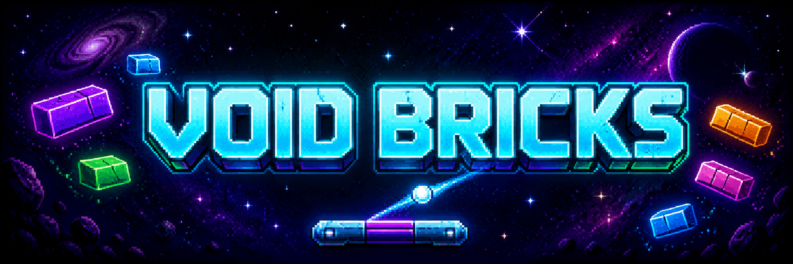

<p align="center">
  
</p>

# Void Bricks

**Void Bricks** is a pixel-art space-themed Arkanoid game developed in **C++ using SFML**.

The project expands the classic brick-breaker formula with multiple levels, different block types, temporary bonuses, persistent records, game-state saving, animated menus, music, and retro sound effects.

The main goal of the project was not only to create a playable game, but also to practice object-oriented programming, clean architecture, polymorphism, and common software design patterns in C++.

---

## About the Game

In Void Bricks, the player controls a paddle and must keep the ball in play while destroying all breakable blocks on the current level.

Each level has its own layout and visual theme. Some blocks require multiple hits, some behave differently when destroyed, and others cannot be broken at all.

The player must complete all levels while preserving their remaining lives and collecting bonuses that temporarily modify the paddle or ball.

Gameplay Video:
https://youtu.be/9pk7OwnVJpE

---

## Key Features

### Three Unique Levels

The game includes multiple handcrafted levels with different:

- block layouts;
- pixel-art space backgrounds;
- color themes;
- difficulty progression;
- combinations of regular, durable, glass, and unbreakable blocks.

Levels are loaded from external data instead of being fully hardcoded into the game logic.

### Different Block Types

Void Bricks contains several block types with their own behavior:

- **Regular Block** — destroyed after one hit;
- **Durable Block** — requires multiple hits and changes appearance after taking damage;
- **Glass Block** — breaks on contact without producing a normal ball bounce;
- **Unbreakable Block** — cannot be destroyed and acts as a permanent obstacle.

This makes each level more varied than a standard single-hit Arkanoid layout.

### Bonus System

Destroying a block may spawn a falling bonus.

Available effects include:

- wider paddle;
- increased paddle speed;
- extra life.

Temporary effects have a limited duration and are automatically reverted when their timer expires.

### Save and Load System

The game supports saving the current gameplay session.

The save data includes:

- current level;
- current score;
- remaining lives;
- paddle position;
- ball position;
- ball velocity;
- destroyed block states.

The player can leave an unfinished session and continue from the saved state later.

### Persistent Records Table

Void Bricks includes a local high-score system.

The game:

- stores player records between launches;
- displays a dedicated records screen;
- compares the current result with saved records;
- updates the table when a better score is achieved.

### Game State Management

The game is separated into multiple states:

- Main Menu;
- Playing;
- Pause Menu;
- Victory;
- Game Over;
- Records;
- Exit Dialog.

The state stack allows temporary screens, such as the pause menu, to be displayed over the active gameplay state without destroying the current session.

### Pixel-Art Space Presentation

Each level has its own pixel-art cosmic environment.

The visual style includes:

- nebulae and distant planets;
- alien ruins and floating structures;
- unique level color palettes;
- retro interface elements;
- arcade-inspired visual effects.

### Music and Sound Effects

The game includes:

- looping main-menu music;
- gameplay music;
- ball collision sounds;
- block destruction sounds;
- bonus pickup sounds;
- life-loss sounds;
- menu navigation effects.

The audio design follows the retro pixel-art style of the game.

---

## Design Patterns

Several software design patterns are used throughout the project.

### Singleton

`Application` is implemented as a Singleton.

It provides a single application instance that owns the main window and controls the game loop.

### State

The project uses game states to separate the behavior of the main menu, gameplay, pause screen, victory screen, game-over screen, and records screen.

Each state has its own data, event handling, update logic, and rendering logic.

### Factory Method

Block creation is handled through block factories.

Different factories create different block implementations:

- `RegularBlockFactory`;
- `ThreeHitBlockFactory`;
- `GlassBlockFactory`;
- `UnbreakableBlockFactory`.

This allows the level loader to create blocks by type without depending directly on their concrete construction logic.

### Observer

Blocks notify observers when they are destroyed.

`BlocksDestroyObserver` tracks:

- the total number of observed breakable blocks;
- the number of destroyed blocks;
- whether the level has been completed.

This keeps level-completion tracking separate from individual block logic.

### Strategy

Bonus behavior is implemented through interchangeable bonus effect classes.

Each effect follows the same interface but applies different behavior to the paddle, ball, or player lives.

### Composite

The menu system is represented as a hierarchy of `MenuItem` objects.

A menu item may contain child items, which allows nested menus to be processed through the same interface.

### Template Method

The collision system defines a shared collision-checking workflow in the base collision abstraction while allowing concrete game objects to provide their own collision response.

---

## Architecture Overview

The project is divided into several logical areas.

### Core

Responsible for:

- application lifetime;
- the main game loop;
- window management;
- state transitions;
- persistent records.

Main classes:

- `Application`;
- `Game`;
- `GameState`.

### Gameplay

Responsible for:

- ball movement;
- paddle controls;
- collision handling;
- block behavior;
- score and lives;
- level completion.

Main classes:

- `Ball`;
- `Paddle`;
- `Block`;
- `DurableBlock`;
- `GlassBlock`;
- `UnbreakableBlock`.

### Bonuses

Responsible for:

- random bonus generation;
- falling bonus objects;
- applying effects;
- tracking effect duration;
- reverting temporary effects.

Main classes:

- `Bonus`;
- `BonusFactory`;
- `BonusEffect`;
- `WidePaddleEffect`;
- `FastPaddleEffect`;
- `ExtraLifeEffect`.

### Levels

Responsible for:

- reading level layouts;
- converting level symbols into block types;
- providing level data to the gameplay state.

Main classes:

- `LevelLoader`;
- `LevelData`;
- `LevelBlockData`.

### User Interface

Responsible for:

- main menu navigation;
- pause menu;
- records screen;
- menu item hierarchy;
- menu backgrounds and hints.

Main classes:

- `Menu`;
- `MenuItem`;
- `MenuBackground`.

---

## Controls

### Main Menu

| Key | Action |
|---|---|
| Up / Down Arrow | Select menu item |
| Enter | Confirm |
| Escape | Go back or exit |

### Gameplay

| Key | Action |
|---|---|
| Left Arrow | Move paddle left |
| Right Arrow | Move paddle right |
| Escape | Open pause menu |

Controls may vary slightly depending on the current game state.

---

## Technologies

- **C++17**
- **SFML**
- **Visual Studio**
- Object-oriented programming
- Standard Template Library
- File-based persistence
- External level configuration

---

## Project Structure

```text
Arkanoid/
├── ArkanoidGame/        # Game source code and assets
├── SFML/                # SFML dependencies
├── Game.sln             # Visual Studio solution
└── README.md
```

---

## Building the Project

### Requirements

- Windows
- Visual Studio with C++ development tools
- A compiler with C++17 support

### Build Steps

1. Clone the repository:

```bash
git clone https://github.com/Starscream44/Arkanoid.git
```

2. Open:

```text
Game.sln
```

3. Select the Arkanoid game project as the startup project.

4. Choose the desired configuration:

```text
Debug
```

or:

```text
Release
```

5. Build and run the solution.

The repository already contains the SFML dependencies required by the Visual Studio solution.

---

## Possible Future Improvements

- additional levels;
- more bonus types;
- multiple balls;
- configurable controls;
- difficulty modes;
- boss levels;
- particle effects;
- in-game volume settings;
- level editor;
- achievements;
- controller support;
- automated tests for gameplay systems.

---

## Educational Purpose

Void Bricks was developed as an educational C++ project.

The project demonstrates practical use of:

- inheritance;
- polymorphism;
- interfaces;
- composition;
- smart pointers;
- STL containers;
- resource management;
- file input and output;
- game-state architecture;
- software design patterns.

---

## Author

Developed by **Egor Nikitin**.

GitHub: [Starscream44](https://github.com/Starscream44)

---

## License

This project was created for educational purposes using an existing course project template.

The source code, bundled libraries, fonts, music, sound effects, and graphical assets may have different licensing terms. Review the license of each third-party component before redistributing or using the project commercially.
